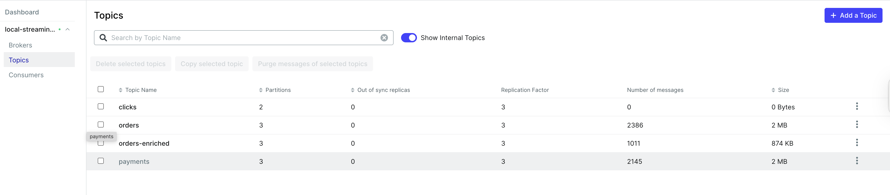

# Real-Time Streaming Analytics

A self-contained streaming pipeline running entirely in Docker for learning real-time data processing. Stimulated orders and payments flow through Kafka cluster, get processed by Spark Structured Streaming, and land in Postgres — with a second streaming job that joins both streams back into Kafka.

## Architecture

```
┌─────────────────────────────────────────────────────────────────────┐
│                          Docker Network                             │
│                                                                     │
│   ┌─────────────┐    orders / payments     ┌─────────────────────┐  │
│   │  Generator  │ ───────────────────────► │   Kafka Cluster     │  │
│   │  (Python)   │                          │   3 brokers, KRaft  │  │
│   └─────────────┘                          │                     │  │
│                                            │  topics:            │  │
│                                            │  • orders      (×3) │  │
│                                            │  • payments    (×3) │  │
│                                            │  • orders-enriched  │  │
│                                            └──────────┬──────────┘  │
│                                                       │             │
│                              ┌────────────────────────┤             │
│                              │                        │             │
│                   ┌──────────▼──────────┐  ┌──────────▼──────────┐  │
│                   │  Spark Aggregator   │  │  Spark Enricher     │  │
│                   │  (always running)   │  │  (profile: enrich)  │  │
│                   │                     │  │                     │  │
│                   │  reads: orders      │  │  reads: orders      │  │
│                   │  window: 1 min      │  │        + payments   │  │
│                   │  watermark: 30s     │  │  join on order_id   │  │
│                   └──────────┬──────────┘  └──────────┬──────────┘  │
│                              │                        │             │
│                   ┌──────────▼──────────┐             │             │
│                   │      Postgres       │   ┌─────────▼──────────┐  │
│                   │  order_metrics      │   │  orders-enriched   │  │
│                   │  (windowed totals)  │   │  Kafka topic       │  │
│                   └─────────────────────┘   └────────────────────┘  │
│                                                                     │
│   Spark cluster: master + 2 workers + history server                │
│   Each streaming job capped at 2 cores (spark.cores.max=2)          │
└─────────────────────────────────────────────────────────────────────┘
```

## Services

| Component | Image | Role |
|---|---|---|
| Generator | Python 3.11 (custom) | Produces order + payment events |
| Kafka | apache/kafka:4.2.0 | 3-broker KRaft cluster|
| Kafka UI | provectuslabs/kafka-ui | Kafka UI browser at `:8080` |
| Spark | apache/spark:4.0.0 | Structured Streaming, standalone cluster |
| Postgres | postgres:16 | Aggregated metrics sink |

## Prerequisites

- Docker Desktop 
- Ports free: `8080`, `8081`, `18080`, `4040`, `4041`, `5433`

## Quickstart

**1. Configure credentials**

```bash
cat > .env << 'EOF'
POSTGRES_DB=streaming
POSTGRES_USER=streamer
POSTGRES_PASSWORD=streamer
EOF
```

**2. Create local directories** (avoids Docker volume permission errors)

```bash
mkdir -p ivy-cache checkpoints/aggregator checkpoints/stream_enricher spark-events
```

**3. Start the base pipeline**

```bash
docker compose up -d --build
```

The aggregator takes ~60 seconds to start as Ivy downloads the Kafka and Postgres JARs on first run. Subsequent starts are instant.

**4. Watch it run**

```bash
# Generator confirming deliveries to Kafka
docker compose logs -f generator

# Spark aggregator printing windowed results every 10 seconds
docker compose logs -f aggregator
```

**Expected aggregator output:**
```
Batch: 4
+------------------------------------------+-----+-----------+--------+
|window                                    |user |order_count|revenue |
+------------------------------------------+-----+-----------+--------+
|{2024-01-01 10:05:00, 2024-01-01 10:06:00}|alice|12         |487.63  |
|{2024-01-01 10:05:00, 2024-01-01 10:06:00}|bob  |9          |312.41  |
+------------------------------------------+-----+-----------+--------+

[batch 2] wrote 5 rows to postgres
```
**Sample Kafka UI**



**5. Query Postgres**

```bash
docker exec -it postgres psql -U streamer -d streaming \
  -c "SELECT * FROM latest_metrics ORDER BY revenue DESC;"
```

## Observability

| UI | URL | What to look for |
|---|---|---|
| Kafka UI | http://localhost:8080 | Topic message counts, partition distribution |
| Spark Master | http://localhost:8081 | Running applications, worker resources |
| Aggregator UI | http://localhost:4040 | Active jobs, stages, task timelines |
| Spark History | http://localhost:18080 | Completed job execution plans |

## Optional: Stream-Stream Join

Start the enricher job, which joins orders to their payments within a 3-minute event-time window and writes matched records back to Kafka:

```bash
docker compose --profile enrich up -d stream-enricher
```

Consume the enriched stream:

```bash
docker exec -it kafka_1 /opt/kafka/bin/kafka-console-consumer.sh \
  --bootstrap-server kafka-1:9092,kafka-2:9092,kafka-3:9092 \
  --topic orders-enriched \
  --from-beginning
```

**Expected output** (one JSON per matched order+payment):
```json
{"order_id":"3f4a1bc2-...","user":"alice","item":"sushi","quantity":2,
 "price":18.99,"payment_id":"9d2e8f...","amount":37.98,"payment_status":"success"}
```

Note: ~10% of orders intentionally have no matching payment (generator behaviour), so they will never appear in this topic.

## Experiments

```bash
# Push events faster (stress test backpressure)
docker compose run --rm -e ORDERS_INTERVAL_SEC=0.1 generator

# Skew traffic to one user (observe uneven partition load)
docker compose run --rm -e USER_POOL=alice,alice,alice,bob generator

# Replay the aggregator from scratch (clears checkpoint, re-reads from Kafka offset 0)
rm -rf checkpoints/aggregator && docker compose restart aggregator
```

## Reset

```bash
docker compose --profile enrich down
docker compose down -v
rm -rf checkpoints spark-events ivy-cache
```

## Project Layout

```
├── generator/
│   └── generator.py        # Kafka producer (orders + payments)
├── spark/
│   ├── aggregator.py       # Tumbling window aggregation → Postgres
│   └── stream_enricher.py  # Stream-stream join → Kafka
├── postgres/
│   └── init.sql            # Schema + latest_metrics view
├── schemas/                # JSON Schema contracts for event validation
├── docker-compose.yaml
├── Dockerfile              # Generator image
├── README.md
└── architecture.md         # Deep-dive on design decisions
```

See [docs/architecture.md](docs/architecture.md) for a detailed explanation of every design decision in this pipeline.