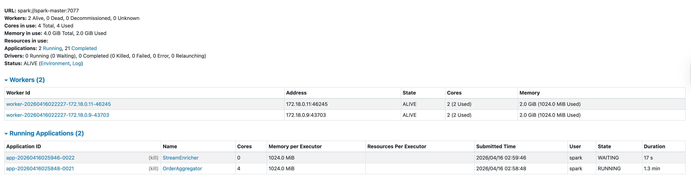

# Architecture Deep-Dive

Detailed explanation for the systems architecture!

---

## 1. Why a 3-Broker Kafka Cluster?

The cluster runs three brokers (`kafka-1`, `kafka-2`, `kafka-3`) with these settings:

```yaml
KAFKA_DEFAULT_REPLICATION_FACTOR: 3
KAFKA_MIN_INSYNC_REPLICAS: 2
```

**Replication factor 3** means every message is written to all three brokers. One broker can die and no data is lost.

**Min in-sync replicas (ISR) = 2** means a producer acknowledgement (`acks=all`) is only returned once at least 2 brokers have confirmed the write. This prevents data loss in the window between a leader receiving a write and its replicas catching up. It also means the cluster tolerates losing 1 broker without affecting writes, but losing 2 brokers causes producers to stall (by design — this is the durability guarantee).

In production we would use more brokers. Three is the minimum that gives us meaningful fault tolerance with ISR=2.

**KRaft mode (no ZooKeeper)** — Kafka 3.x removes the ZooKeeper dependency entirely. Each broker here acts as both a broker and a controller voter. The controller quorum manages partition leadership without any external coordination service. This simplifies operations and removes a significant operational burden from production setups.

---

## 2. Topic Partition Design

```
orders          → 3 partitions
payments        → 3 partitions
orders-enriched → 3 partitions
```

**Why does partition count matter?** Each Kafka partition maps to exactly one Spark task during a micro-batch read. This is the hard ceiling on read parallelism. With 3 partitions and 2 Spark executor cores, all 3 partitions are read near-simultaneously (3 tasks, 2 cores, one partition waits briefly for a free core).

If you had 1 partition, all reads would be single-threaded regardless of how many Spark cores you provision. If you had 10 partitions but only 4 cores, you'd process 4 partitions at a time in waves. The right number is typically 2–3× your target consumer parallelism to allow for rebalancing headroom.

**`AUTO_CREATE_TOPICS_ENABLE: false`** is intentional. Topics are created explicitly by the `kafka-init-topics` service with precise partition counts. Allowing auto-creation would let any misconfigured producer silently create a topic with wrong settings (e.g., 1 partition, replication 1).

---

## 3. The Generator

The generator is a plain Python process using the `confluent-kafka` library (not PySpark). It runs in its own container built from a minimal `python:3.11-slim` image.

**Key behaviours:**

- Produces one order per `ORDERS_INTERVAL_SEC` (default 0.5s = 2 orders/second)
- 90% of orders get a corresponding payment, 10% do not — this intentional gap is what makes the stream-stream join non-trivial
- Payment status is weighted: 85% success, 10% failed, 5% pending
- Events are keyed by `order_id` on both topics, ensuring an order and its payment land on the same Kafka partition (same key → same partition via hash). This matters for the join correctness under high parallelism

The `schemas/` folder contains JSON Schema files used by the generator for local validation before publishing. This is a lightweight contract check that catches bugs in the producer without requiring a registry.

---

## 4. Spark Cluster Layout

```
spark-master      → cluster manager only, no execution
spark-worker-1    → 2 cores, 2g RAM
spark-worker-2    → 2 cores, 2g RAM
spark-history-server → reads spark-events volume, serves completed job UIs
```

The cluster offers **4 cores and 4g RAM** total. Each streaming job is capped at `spark.cores.max=2`, meaning:

- Aggregator gets 1 executor on one worker (2 cores, ~1g RAM)
- Enricher (when running) gets 1 executor on the other worker (2 cores, ~1g RAM)
- Both jobs run in parallel without resource contention

Without `spark.cores.max`, Spark standalone is greedy — an app will claim all available cores the moment they are free. This caused the corrupted checkpoint issue encountered during development: the enricher grabbed all 4 cores mid-batch, the aggregator was starved, both kept restarting, and partially-written state delta files accumulated.


*Figure 1: Spark Cluster resource starvation*

In the screenshot above, we can see that the OrderAggregator app is greedy, as it claimed all the availables cores,forcing the StreamEnricher app to be in the "Waiting" status, as there is no resource for it to operate.

---

## 5. The Aggregator: Tumbling Windows and Watermarks

```python
orders.withWatermark("event_time", "30 seconds")
      .groupBy(window(col("event_time"), "1 minute"), col("user"))
      .agg(count("*"), sum(quantity * price))
```

**Tumbling window** — non-overlapping 1-minute buckets. Every event belongs to exactly one window. The alternative is a sliding window (e.g., "last 5 minutes, sliding every 1 minute"), where events can belong to multiple windows simultaneously.

**Watermark** — the mechanism Spark uses to decide when a window is "done." Spark tracks the maximum `event_time` seen so far and defines the watermark as `max_event_time - delay`. Any window whose end is before the watermark is considered complete and will be finalized and written to Postgres. With a 30-second delay and 1-minute windows, a window closes roughly 90 seconds after its end time.

**Why does the same window appear across many batches?** A micro-batch trigger (every 10 seconds) and an event-time window (1 minute) are completely independent. Spark wakes up every 10 seconds, reads whatever arrived in Kafka, and updates all affected windows. The window `{10:05, 10:06}` accumulates partial results across ~6 trigger cycles before the watermark advances enough to finalize it.

**Two streaming queries in one app (console + postgres):** Both queries share the same `SparkSession` and the same `windowed` DataFrame. Spark materializes the computation once and fans the output to both sinks. The checkpoint only covers `postgres_out` (the one with a `checkpointLocation`) — the console query uses a temporary checkpoint that is deleted on shutdown.

---

## 6. The Enricher: Stream-Stream Joins

```python
orders_wm.join(
    payments_wm,
    expr("o.order_id = p.order_id AND p.timestamp BETWEEN o.timestamp AND o.timestamp + INTERVAL 3 MINUTES"),
    how="inner",
)
```

Stream-stream joins are fundamentally different from stream-batch joins. Neither side is fully known — both sides are infinite streams, so Spark must buffer "unmatched" records from each side in a state store, waiting for a match to arrive within the time bound.

**State store**: Spark writes the unmatched left (orders) and unmatched right (payments) to delta files in the checkpoint directory: `checkpoints/stream_enricher/state/0/N/left-keyToNumValues/` and similar. These delta files are the serialized state store, written incrementally each micro-batch. If the container is killed mid-write, the next delta file is missing on restart — that is the `CANNOT_READ_DELTA_FILE_NOT_EXISTS` error encountered during development. Clearing the checkpoint forces a clean state reconstruction.

**The 3-minute join window + 2-minute watermark**: An order is held in state for up to `watermark_delay + join_window = 2 min + 3 min = 5 minutes` before Spark gives up waiting for a payment. After that, the order is evicted from state (memory freed) and will never match. This is what happens to the ~10% of orders with no payment.

**Why `inner` join, not `left outer`?** Left outer joins in stream-stream joins are supported but require the watermark to advance before emitting null-matched rows — the output is delayed by the full watermark period. For this demo, inner join (only emit matched pairs) is simpler and produces visible output faster.

**Output to Kafka (`outputMode("append")`)**: The enricher writes joined records back to Kafka. Append mode is the only valid output mode for stream-stream joins — update mode is not supported because a join result, once emitted, is final and cannot be retracted. Each matched pair is serialized to JSON and written to `orders-enriched` with the `order_id` as the Kafka key, which preserves per-order ordering within a partition.

---

## 7. Checkpointing and Fault Tolerance

Every stateful streaming job needs a checkpoint directory. Checkpoints contain:

1. **Offsets** — the Kafka partition offsets committed at the end of each successful micro-batch. On restart, Spark reads these and resumes from exactly where it left off, with no duplicate processing and no gaps.
2. **State** — for stateful operations (windowed aggregations, stream-stream joins), the serialized state store delta files that allow Spark to reconstruct in-flight windows without reprocessing all input data.
3. **Metadata** — query configuration, schema, and execution plan snapshots.

**Why bind-mount `./checkpoints` instead of using a named volume?** Same permission reason as spark-events — bind mounts are host-user-owned. Additionally, bind mounts make it trivial to inspect and delete checkpoint state during development (`rm -rf checkpoints/aggregator` to force a full replay from Kafka offset 0).

**`startingOffsets: earliest`** — both jobs read from the beginning of each topic on their first run (no checkpoint yet). On subsequent runs with a valid checkpoint, this setting is ignored — Spark uses the checkpointed offsets instead. This means stopping and restarting the aggregator will not reprocess old data unless you explicitly delete its checkpoint.

---

## 8. Ivy Cache and JAR Management

Spark's `--packages` flag resolves Maven dependencies at runtime using Apache Ivy. The first time the aggregator starts, Ivy downloads:

- `spark-sql-kafka-0-10_2.13:4.0.0` — the Kafka source/sink connector
- `postgresql:42.7.3` — the JDBC driver for Postgres

These JARs are cached in `./ivy-cache` (bind-mounted to `/tmp/.ivy2` inside the container). Subsequent restarts skip the download entirely, taking seconds instead of ~60 seconds.

**Why not pre-bake the JARs into a custom Docker image?** For a learning project, `--packages` is simpler to understand and modify. In production, you would build a custom Spark image with JARs pre-installed to eliminate the Ivy dependency at runtime, reduce startup time, and make the image fully air-gapped.

---

## 9. What Is Not Here (and Why)

| Missing piece | Why omitted | What you'd add in production |
|---|---|---|
| Schema Registry | Adds a service dependency; JSON Schema in-code is sufficient for learning | Confluent Schema Registry + Avro serialization |
| Authentication | Local dev only | Kafka SASL/SCRAM, Spark ACLs, Postgres roles |
| TLS | Local dev only | Kafka TLS listeners, Postgres `sslmode=require` |
| Dead-letter queue | Low volume, errors logged | Separate Kafka topic for malformed events |
| Exactly-once sink | Postgres append is at-least-once | Idempotent writes using `ON CONFLICT DO UPDATE` |